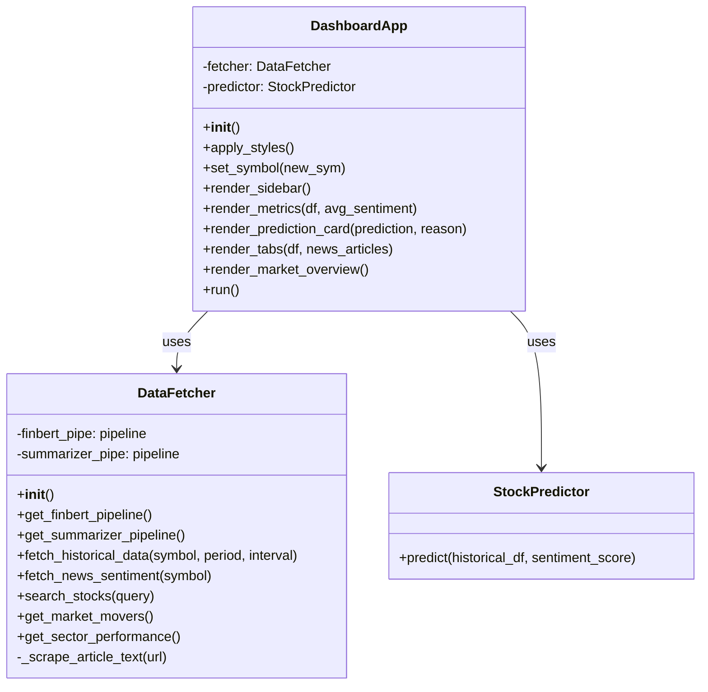

# StockPredictorApp System Design

This document describes the Object-Oriented Design of the StockPredictorApp.

## Component Descriptions

- **DataFetcher**: Responsible for interacting with external data sources (Yahoo Finance, news articles) and running AI logic for sentiment analysis and summarization.
- **StockPredictor**: Contains the business logic for predicting stock movement based on technical indicators and sentiment scores.
- **DashboardApp**: The main UI component built with Streamlit, coordinating user input, data fetching, and prediction display.
